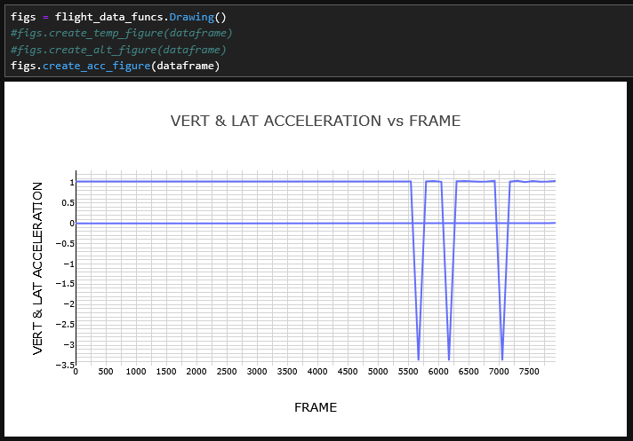

<p align="center">


# ETL for flight data recorder files to AWS S3 datalake using python
</p>

A tutorial on how to extract-transform-load the NASA Sample Flight Dataset, as downloaded from https://c3.ndc.nasa.gov/dashlink/projects/85/ at the moment of writing this doc into AWS S3.

A personal AWS account is required in order to save to AWS. Credentials also need to be configured before being able to use AWS CLI. More instructions available at: 
https://docs.aws.amazon.com/cli/latest/reference/


The dataset can still be manipulated locally without an AWS account.


The tutorial focuses on: 
   1. getting the dataset to a local computer,
   2. saving the local dataset to AWS S3 object storage in raw format,
   3. reading the data from AWS S3
   4. transforming .mat files into dataframe
   5. saving dataframe to AWS S3 as parquet files
   6. exploring parquet files using AWS Athena


## Table Of Contents

- [Prepare NASA dataset](#extraction)
    - [Get zipped files to your computer](#getfiles)
    - [Unzip locally](#unzipfiles)
    - [OPTIONAL: Save files to S3 in raw format using AWS S3 sync](#aws-s3-sync)
- [Transform NASA dataset](#transform)
    - [Parse raw files into a structured dataframe](#parse-files)
    - [Read raw format files from s3 or from local](#read-s3-boto3)
    - [Remove columns with duplicated names](#remove-duplicated-col-names)
    - [Save dataframe to S3 as parquet](#write-s3-parquet)
- [Analyze NASA dataset](#analyze)
    - [Use AWS athena to query big flight data](#aws-athena)


#### extraction
## Prepare NASA dataset


##### A note on flight data files.

Flight data files format may change depending on the flight data recorder model/manufacturer/configurations. The files obtained from unzipping NASA flight dataset are similar to those of real flight data recorders but not identical. If different flight data files used, adjust code accordingly using available data recorder/airframe information. 


#### getfiles
## Get zipped files to your computer

1. Create a new folder in your working directory

    `mkdir flight_data`

    `cd flight_data`

2. Download the file download_flight_data.sh from https://c3.ndc.nasa.gov/dashlink/projects/85/. You can directly download it here: https://c3.ndc.nasa.gov/dashlink/static/media/project/download_flight_data_2.sh

    `wget https://c3.ndc.nasa.gov/dashlink/static/media/project/download_flight_data_2.sh`

3. Create a new subfolder called zip_data. Change to that directory. Execute the bash file in your linux terminal to download the full dataset
    `mkdir zip_data`

    `cd zip_data`

    `bash ../dowload_flight_data.sh`


4. Files will start downloading, it may take some time for the full dataset to download. You may only download a few files if you like. Check the progress on your working folder an interrupt the download at anytime if require.
    


#### unzipfiles
## Unzip locally

1. Unzip some Tail_xxx_x.zip files downloaded from NASA website. You can use the `Unzipping` class in [flight_data_funcs.py](https://github.com/chisus089/flight_data_tutorial/blob/main/flight_data_funcs.py) or any other tool to unzip files to a new folder within your `flight_data` folder called `extracted_data`. 

```
import flight_data_funcs
import os

unzipper = flight_data_funcs.Unzipping()
file_list = os.listdir("zip_data/")[0:2] #index at the end to unzip only the first two files of the list
list(map(unzipper.extract_from_zip, file_list))

```


2. After extracting, you should be able to see a folder for each zip file, each folder with a few `.MAT` files


At this moment, raw files may be backed up in a cloud object storage. Further analysis can continue either from local raw files or cloud backed up raw files. 

Backing up raw files would be a good practice if looking to build a more robust data governed solution. Local is recommended for quick, cheap, viable exploratory analysis. 

Unzipping all .MAT files from the full dataset to your local may saturate your local storage and affect performance. Deleting unzipped .MAT files after analysis is recommended if working local.


#### aws-s3-sync
## OPTIONAL: Save files to S3 in raw format using AWS S3 sync


1. Use AWS S3 sync command to copy your local raw files folder to your previously configured personal AWS S3 account. More info at: https://docs.aws.amazon.com/cli/latest/reference/s3/sync.html https://docs.aws.amazon.com/cli/v1/userguide/cli-configure-files.html

2. Create a new empty folder in a S3 bucket using your preferred method. Easiest one is AWS web console UI. More info on creating S3 buckets: https://docs.aws.amazon.com/AmazonS3/latest/userguide/create-bucket-overview.html

3. Execute `aws s3 sync` command. See example below.

    Syntax:

    `$ aws s3 sync <source> <target> [--options]`

    Example:

    `$ aws s3 sync . s3://aws-root-main/flight_database/raw/`


    

    


#### transform
## Transform NASA dataset


Download [flight_data_funcs.py](https://github.com/chisus089/flight_data_tutorial/blob/main/flight_data_funcs.py) to your working directory.

To read from local:

```
import flight_data_funcs
import os

ff = flight_data_funcs.ListingMatFiles(aws=False)
paths=os.listdir('extracted_data')
allpaths=ff.get_local_paths(paths)
path=allpaths['Tail_658_1'][0]

dataframe = flight_data_funcs.Parsing(path, verbose=True).mat_to_dataframe()
print(dataframe.shape)

root, tail, filename = path.split("/")
print(root, tail, filename)

```


#### read-s3-boto3
## Read raw format files from s3


Use the class ListingMatFiles within [flight_data_funcs.py]

To read from AWS S3:

```
bucket= 'aws-root-main'
key= 'flight_database/raw/Tail_652_1'

ff = flight_data_funcs.ListingMatFiles(bucket, key, aws=True)
file = ff.read_files(ff.gen_obj_list()[0])

tail = ff.gen_obj_list()[0].key.split("/")[-2]
filename = ff.gen_obj_list()[0].key.split("/")[-1]

dataframe = flight_data_funcs.Parsing(file, verbose=True, aws=True).mat_to_dataframe()
print(dataframe.shape)
print (tail, filename)
```


Notice how in both previous cases both tail and filename are stored in variables, regardless the source of the .MAT file. These two variables are used later while saving to a database.

#### parse-files
## Parse raw files into a structured dataframe


After reading either from local or from cloud, the .MAT files need to be transformed into structured tables (dataframe  ). Pandas framework will be used in order to do so, and the logic is found in the Parsing class within [flight_data_funcs.py](https://github.com/chisus089/flight_data_tutorial/blob/main/flight_data_funcs.py).

.MAT files are basically MATLAB array files. The array includes both data and metadata. The idea is to use the metadata(parameter name, parameter resolution, array length) and the data to build the structured table. It is important to take the frequency at which each parameter is recorded into consideration.

Use the class Drawing within [flight_data_funcs.py](https://github.com/chisus089/flight_data_tutorial/blob/main/flight_data_funcs.py) to make some basic plots for a quick visual check on data.


```
figs = flight_data_funcs.Drawing()
figs.create_temp_figure(dataframe)
figs.create_alt_figure(dataframe)
figs.create_acc_figure(dataframe)
```





#### Remove columns with duplicated names
## remove-duplicated-col-names

Before saving into a database, duplicated columns need to be renamed. Depending on the case, data schema may also need to be defined.

The schema is the definition of the each column name and each column type of the data.

```
renamed_dataframe = flight_data_funcs.ETLing().rename_col_ifduplicated(dataframe)
renamed_dataframe.columns
```


#### write-s3-parquet
## Save dataframe to S3 as parquet

A data catalog is a logical agroupation of databases, furthermore databases are logical agroupations of tables. So the hierarchy is data catalog cointans databases which cointans tables. AWS has a AwsDataCatalog created by default. For the moment this catalog will be used.

To create a new data catalog, default glue/spark/awswrangler configuration options may need to be modified.

Refer to following links for more information on catalog creation:

https://docs.aws.amazon.com/lake-formation/latest/dg/creating-catalog.html

https://docs.databricks.com/aws/en/sql/language-manual/sql-ref-syntax-ddl-create-catalog


```
from awswrangler import catalog
from awswrangler.s3 import to_parquet

def write_to_aws(dataframe, tail, filename, database_name='flight_data'):

    catalog.create_database(database_name,exist_ok=True)
    
    path=f's3://aws-root-main/flight_database/parquet/{tail}'
    
    to_parquet(df=renamed_dataframe,
               path=path, 
               dataset=True, 
               mode="append",
               filename_prefix=filename,
               database=database_name,
               table=f'{tail}_{filename}')

write_to_aws(dataframe, tail, filename)

```


#### analyze
## Analyze NASA dataset with SQL

#### aws-athena
## Use AWS athena to query big flight data


After being saved as datasets, parquet files may be queried through athena using SQL.


```
SELECT * 
FROM "flight_data"."tail_658_1_658200105012013_mat"
LIMIT 10
```


## To-do
- Add instructions on how to encrypt data before saving to AWS.
- Use cloud visualization tools for data visualizations.


## Team


[Jesus Jorge Martinez Rios](https://www.linkedin.com/in/jesusjmartinezr/) 

## [License](https://github.com/chisus089/flight_data_tutorial/blob/main/LICENSE)

© Jesus Jorge Martinez Rios 

[jesus.martinez89@hotmail.com](jesus.martinez89@hotmail.com)

